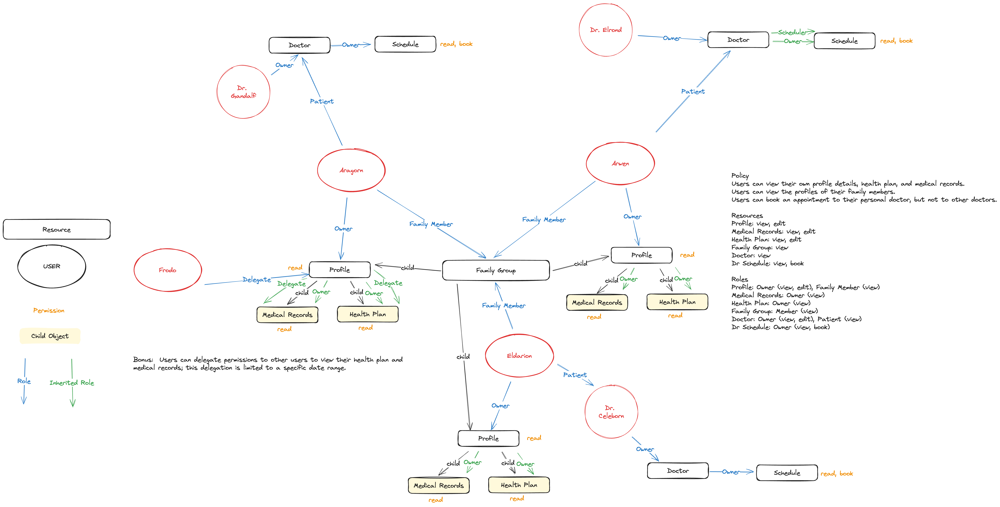

# Permit.io LoTR Health Care Demo App



## Install

`npm install`

`DEBUG=permit-demo:* npm start`


## Profile API

### GET /profile/:userId

**Headers:**
```
CurrentUserName: {loggedInUser}
```

```bash
curl --location 'http://localhost:3000/profile/Aragorn' \
  --header 'Content-Type: application/json' \
  --header 'CurrentUserName: Arwen'
```

### POST /profile/:userId

**Headers:**
```
CurrentUserName: {loggedInUser}
Content-Type: application/json
```
**Body:**
```
The updated json you want to store in the profile. **Warning**: no data sanitization ':)	
```
```bash
curl --location 'http://localhost:3000/profile/Aragorn' \
  --header 'Content-Type: application/json' \
  --header 'CurrentUserName: Aragorn' \
  --data '{
      "id": "pr_2",
      "name": "Aragorn'\''s Profile",
      "age": 88,
      "gender": "male",
      "blood_type": "AB-"
  }'
```

---

## Health Plan API

### GET /plan/:userId

**Headers:**
```
CurrentUserName: {loggedInUser}
```
```bash
curl --location 'http://localhost:3000/plan/Aragorn' \
  --header 'CurrentUserName: Aragorn'
```

### POST /plan/:userId

**Headers:**
```
CurrentUserName: {loggedInUser}
Content-Type: application/json
```
**Body:**
```
The updated json you want to store in the profile. **Warning**: no data sanitization ':)	
```
```bash
curl --location 'http://localhost:3000/plan/Aragorn' \
  --header 'CurrentUserName: Aragorn' \
  --header 'Content-Type: application/json' \
  --data '{
      "id": "aragorn",
      "owner_id": "aragorn",
      "name": "Aragorn'\''s Other Health Plan"
  }'
```

---

## Health Record API

### GET /record/:userId

**Headers:**
```
CurrentUserName: {loggedInUser}
```
```bash
curl --location 'http://localhost:3000/record/Aragorn' \
  --header 'CurrentUserName: Aragorn'
```

### POST /record/:userId

**Headers:**
```
CurrentUserName: {loggedInUser}
Content-Type: application/json
```
**Body:**
```
The updated json you want to store in the profile. **Warning**: no data sanitization ':)	
```
```bash
curl --location 'http://localhost:3000/record/Aragorn' \
  --header 'CurrentUserName: Aragorn' \
  --header 'Content-Type: application/json' \
  --data '{
      "id": "aragorn",
      "owner_id": "aragorn",
      "name": "Aragorn'\''s Other Health Plan"
  }'
```

---

## Doctor API

### GET /doctor/:userId

**Headers:**
```
CurrentUserName: {loggedInUser}
```
```bash
curl --location 'http://localhost:3000/doctor/Gandalf/' \
  --header 'CurrentUserName: Aragorn'
```

### POST /doctor/:userId

**Headers:**
```
CurrentUserName: {loggedInUser}
Content-Type: application/json
```
**Body:**
```
The updated json you want to store in the profile. **Warning**: no data sanitization ':)	
```
```bash
curl --location 'http://localhost:3000/doctor/Gandalf' \
  --header 'CurrentUserName: Gandalf' \
  --header 'Content-Type: application/json' \
  --data '{
      "name": "Gandalf",
      "id": "dr_gandalf",
      "specialty": "Wizardry and Wichcraft",
      "hospital": "Middle-earth Medical Center"
  }''
```

### GET /doctor/:userId/schedule

**Headers:**
```
CurrentUserName: {loggedInUser}
```
```bash
curl --location 'http://localhost:3000/doctor/Gandalf/schedule' \
  --header 'CurrentUserName: Aragorn'
```

### POST /doctor/:userId/schedule

**Headers:**
```
CurrentUserName: {loggedInUser}
Content-Type: application/json
```
**Body:**
```
The updated json you want to store in the profile. **Warning**: no data sanitization ':)	
```
```bash
curl --location 'http://localhost:3000/doctor/Gandalf/schedule' \
  --header 'CurrentUserName: Aragorn' \
  --header 'Content-Type: application/json' \
  --data '[
      {
          "day": "Monday",
          "hours": "9:00 AM - 5:00 PM"
      },
      {
          "day": "Tuesday",
          "hours": "Not Available"
      },
      {
          "day": "Wednesday",
          "hours": "Not Available"
      },
      {
          "day": "Thursday",
          "hours": "9:00 AM - 5:00 PM"
      },
      {
          "day": "Friday",
          "hours": "9:00 AM - 1:00 PM"
      }
  ]'
```
